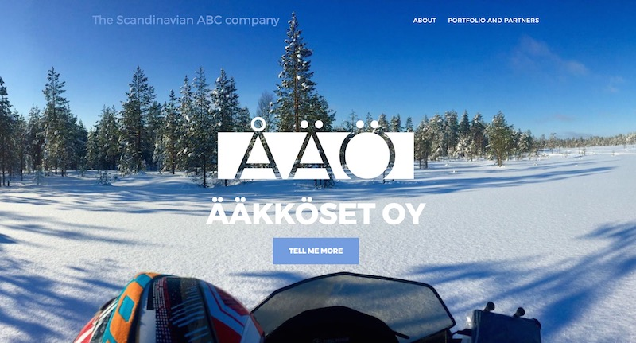

# Scandinavian ABC Website

We develop our [scanabc.com](http://www.scanabc.com) -webpage here.
Contributors, check [CONTRIBUTING.md](CONTRIBUTING.md).

## Testing in Docker

```shell
docker run --rm --volume="$(pwd):/srv/jekyll" -it -p4000:4000 jekyll/jekyll jekyll serve
```

## Stories Behind the Background Pictures

Occasionally we celebrate the achievements of Scandinavian ABC
startups by picking a new background picture to the
[scanabc.com](http://www.scanabc.com) webpage.

### 2017-03 - Full Speed Ahead

[SensorFu](http://www.sensorfu.com/) is founded. Time to go at full throttle!



The day this picture was taken, @Turmi0 gently engaged a tree
with his snowmobile. The result? 1400€ repair service bill.
A couple of days later he completed the paperwork for
SensorFu's initial funding.

### 2017-01 - Back to the Roots, Out to the World

New year arrived and the Finns got a glimpse of the sunlight.


At the end of the year we went back to the roots to finalize
SensurFu plans. Picture is from Pudasjärvi [(map)](https://goo.gl/maps/7EAAAYZgcTp)
, the home town for many of us. And a good place for a retreat.

Pudasjärvi is in the vicinity of Oulu. In the 90s, it got proper
Internet-access among the first small municipalities in Finland.
Early exposure to the Internet gave a good base for youngsters
to learn the perks of networking and security. Growing up, those
youngsters moved to bigger cities and made cyber defense their
career. Many of them work in Scandinavian ABC ecosystem.

### 2016-12 - All of This Has Happened Before

```All of this has happened before - and will happen again.```


At the end of 2013 we released a [video](https://www.youtube.com/watch?v=kWg3BXjtJAo
) video celebrating the successes of cyber firefighters, who early
on adopted the Finnish model for their work.
Now the model is mainstream, and we are pushing the
envelope. Doing things undone, being the underdog again. Feels like home.

In the spirit of Battlestar Galactica (2004) we
used a screenshot of the video to remind us: *All of this has
happened before and will happen again.* [(YouTube clip)](https://youtu.be/6bOy3RNyWME).
