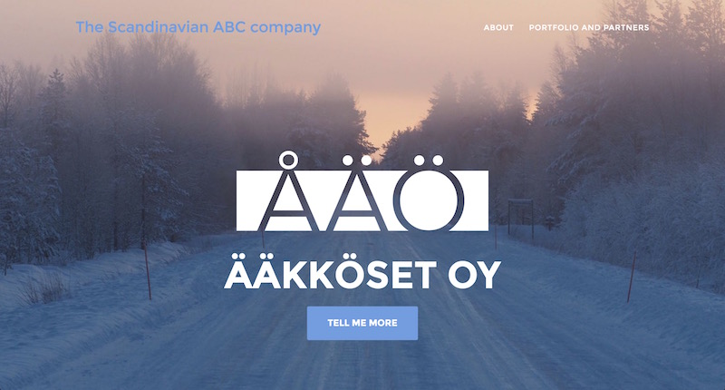
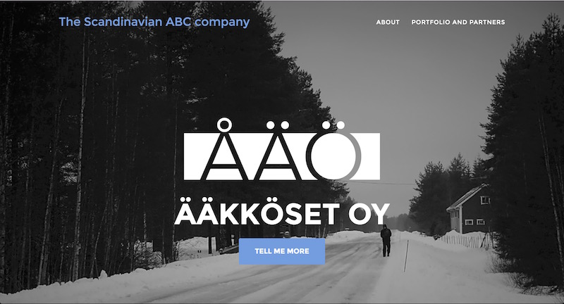

# Web snapshots

Every month we celebrate the different achievements and events in an [all-hands](https://medium.com/@gokulrajaram/all-you-ever-wanted-to-know-about-all-hands-but-were-afraid-to-ask-b13f7b97f2d9#.jf3s99a6g)
session meant for Scandinavian ABC startups. Before each all-hands,
we pick a background picture to [scanabc.com](http://www.scanabc.com)
webpages. The picture is from the life of one or more of the startups.

## 2017-01

New year arrived and the Finns got a glimpse of the sunlight.
Just before the new year, we had a retreat in Pudasjärvi to get SensorFU started.

## 2016-12

In 2014 we released a [video](https://www.youtube.com/watch?v=kWg3BXjtJAo&t=2s
) which celebrated the successes of different
nations who were applying the Finnish model for civilian cyber
defense. In December 2016, Scandinavian ABC startups were working to
bring updates to the model. So we used a screenshot of the video as a
background.
